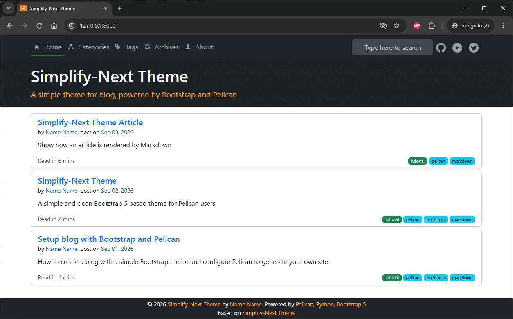

## About

`simplify-next` is a simple, clean, theme for Pelican blogs based on [Bootstrap 5](https://getbootstrap.com/docs/5.3/getting-started/introduction).   
You can use this theme to host programming articles, journals, or galeries.


### Live Demo

Source code is at [simplify-next](https://github.com/vdmitriyev/simplify-next)
The live demo blog with sample articles: <https://vdmitriyev.github.io/simplify-next> 

N.B.: Demo contains the articles, which is also has some ideas about theme's documents.  

### Features

- Responsive layout for mobile and desktop (Bootstrap)
- Quick Search (Stork Search)
- SEO with contentful metadata, ready for search indexing
- Table of Content sidebar with highlight
- Back to Top floating button in long article
- Related posts, next/previous articles
- Collapsible lists in tags and categories
- Social Sharing (static share buttons)
- Comments on articles (Diqus)
- Links to social platforms
- Rich Snippets (metadata, json-ld, sitemap, robots.txt)

### Install

Download the theme from [simplify-next](https://github.com/vdmitriyev/simplify-next) or from [pelican-themes](https://github.com/getpelican/pelican-themes).  
You may need to check the included example `pelicanconf.py` and `publishconf.py` for more information.

The example blog used to develop and preview the theme is found in [`example`](example). All runs (install, build, serve, clean, ...) are done with [`task`](https://taskfiles.dev) — run `task` on its own to list the available tasks.


### Pelican Plugins

Starting with version 4.5, Pelican moved to a new plugin structure utilizing namespace packages that can be easily installed via Pip. Plugins supporting this structure will install under the namespace package pelican.plugins and can be automatically discovered by Pelican. To see a list of Pip-installed namespace plugins that are active in your environment, run:

```
pelican-plugins
```

The list of necessary plugins is now in the `requirements.txt` file, and enabled in `PLUGINS` variable in `pelicanconf.py`

### Integrations

- [Disqus](https://disqus.com/): add comments support
- [Google AdSense](https://www.google.com.br/adsense/start/): show ads
- [Google Analytics](https://www.google.com/analytics/web/): track your site
- [Google Tag Manager](https://www.google.com/tagmanager/): new version to track your site
- [Matomo](https://matomo.org): another site tracking service

### Extra

- GDPR cookie-consent banner: gate analytics/ads/comments trackers behind visitor opt-in

### Plugins Support

- [sitemap](https://github.com/getpelican/pelican-plugins/tree/master/sitemap): generate sitemap document, see <https://www.sitemaps.org>
- [post_stats](https://github.com/getpelican/pelican-plugins/tree/master/post_stats): generate post statistics: words, estimated read time, tag cloud
- [related_posts](https://github.com/getpelican/pelican-plugins/tree/master/related_posts): find relate posts to the reading article
- [neighbors](https://github.com/getpelican/pelican-plugins/tree/master/neighbors): find next/preivious article
- [share_post](https://github.com/getpelican/pelican-plugins/tree/master/share_post): share article via static buttons (Twitter, LinkedIn)
- [search](https://github.com/pelican-plugins/search): generate a [Stork](https://stork-search.net/) search index for the Quick Search feature; requires the `stork` CLI binary to be installed and on `$PATH` before running `task build`/`task serve` (see [Stork install instructions](https://stork-search.net/docs/install))

### Markdown extensions

By default Pelican enables below extensions to process your markdown files:

- `markdown.extensions.extra` includes `abbr`, `attr_list`, `def_list`, `fenced_code`, `footnotes`, and `tables`
- `markdown.extensions.codehilite`
- `markdown.extensions.meta` 

**Simplify** theme has some style configs to work with extra extensions to render your page better:

- `markdown.extensions.sane_lists`
- `markdown.extensions.toc`
- `markdown.extensions.nl2br`
- `markdown_checklist.extension`

### Customized styles

The theme also bring to you a clean, simple, but contenful layout.  
The following article will guide you how to write content in markdown and how it will be rendered on your page:
- [Simplify Article](https://vdmitriyev.github.io/simplify-next/blog/simplify-article.html) 

### Preview



### How to contribute

Feel free to fork the [repository](https://github.com/vdmitriyev/simplify-next), and submit pull requests.  
If you find any issues, or have a suggestion, then please open an [issue](https://github.com/vdmitriyev/simplify-next/issues).

### License

`simplify-next` is released under the MIT license and is a derivative of other template. See [LICENSE.md](LICENSE.md) for further details.
